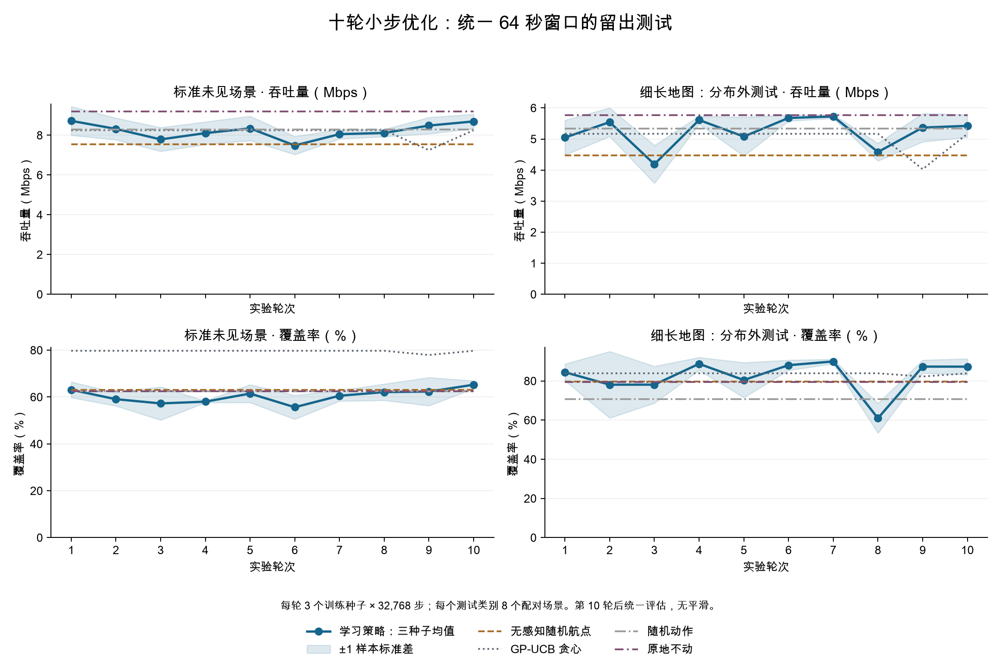
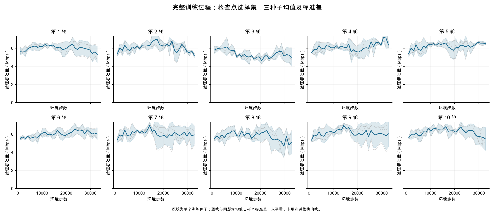
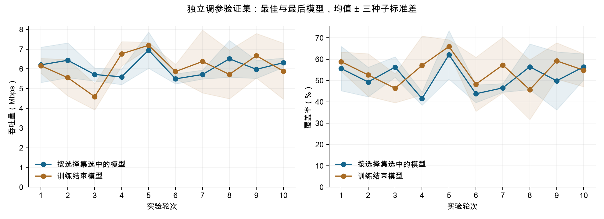
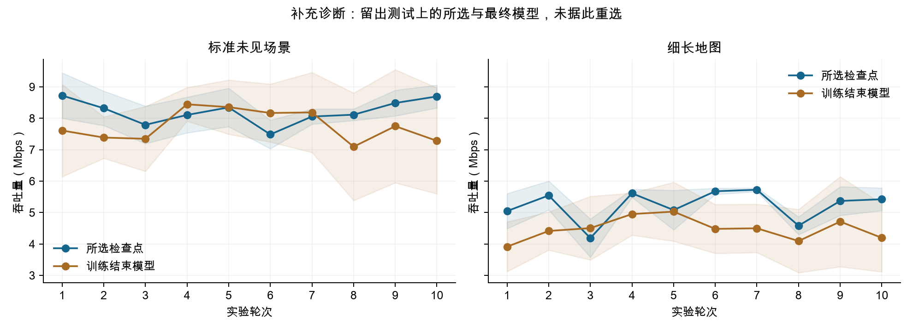

# 十轮小步优化：未知聚类环境中的 UAV 部署

## 本轮结论

验证集选出的第 5 轮，在标准未见场景上为 **8.346 Mbps**，低于原地不动的 **9.187 Mbps**；在细长地图上为 **5.079 Mbps**，也低于原地不动的 **5.762 Mbps**。相对第 1 轮，标准场景略降、细长地图基本持平。

**这十轮没有证明已克服未知环境，也没有得到稳定优于简单基线的策略。** 验证集改善未转化为明确的泛化收益；完整曲线还显示训练退化和模型选择波动。不能仅归因于“训练步数不够”。

## 已完成的实验

十轮均已完整运行，三种子各 32,768 步，共 30 次 MPS 训练、983,040 环境步。每轮训练前后均有 Git 记录，完整逐更新日志、每场景评估、模型哈希和源提交已保留。此前因任务澄清而停止或被替代的固定布局/航程预算诊断单独存档，不计入这十轮。

场景包含随机矩形尺寸、随机 UAV 起点，以及位置、尺度、方向、权重、数量均变化的人群簇。只保留地图边界、最低高度和机间防碰撞；当前固定合法高度、二维移动，无障碍物、无航程预算，每回合完整运行 64 秒。Actor 不读取真实用户位置或通信服务指标。

实验协议见 [protocol.md](protocol.md)。训练与模型选择场景、调参验证场景、最终测试场景互相分开。最终测试在十轮结束后统一进行，没有据此进一步调整算法。

## 折线图

误差带为三个训练种子的场景均值之间的样本标准差。每类测试包含八个配对场景；细长地图的长宽比分布没有用于训练。图中保留随机动作、原地不动、GP-UCB 贪心和不使用感知的随机航点基线，不只展示对学习策略有利的对照。

上图使用每 1024 个环境步的检查点选择集评估，无平滑、无曲线筛选。灰线是三个种子，蓝线是均值。它描述训练进程，不能替代最终测试。

补充诊断同时评估所有轮次的最终模型，主版本仍按原定验证规则选择，不据此重新挑模型。

## 十轮改动与验证记录

- [第 1 轮：固定时长的随机场景基准](r01.md)：调参验证吞吐量 **6.203 ± 0.895 Mbps**，覆盖率 55.61%。
- [第 2 轮：分开裁剪策略与价值网络梯度](r02.md)：调参验证吞吐量 **6.434 ± 0.883 Mbps**，覆盖率 49.31%。
- [第 3 轮：增加每次更新的新轨迹批量](r03.md)：调参验证吞吐量 **5.712 ± 0.328 Mbps**，覆盖率 56.30%。
- [第 4 轮：延长优势递推的有效范围](r04.md)：调参验证吞吐量 **5.596 ± 0.393 Mbps**，覆盖率 41.52%。
- [第 5 轮：减小熵正则强度](r05.md)：调参验证吞吐量 **6.949 ± 0.917 Mbps**，覆盖率 62.05%。
- [第 6 轮：降低学习率](r06.md)：调参验证吞吐量 **5.492 ± 0.256 Mbps**，覆盖率 43.79%。
- [第 7 轮：降低不确定性代理奖励的权重](r07.md)：调参验证吞吐量 **5.713 ± 0.228 Mbps**，覆盖率 46.54%。
- [第 8 轮：增加网络隐藏宽度](r08.md)：调参验证吞吐量 **6.509 ± 0.933 Mbps**，覆盖率 56.44%。
- [第 9 轮：缩短 GP 空间相关长度](r09.md)：调参验证吞吐量 **5.975 ± 0.458 Mbps**，覆盖率 49.86%。
- [第 10 轮：增加自身位置附近的信念视图](r10.md)：调参验证吞吐量 **6.309 ± 0.235 Mbps**，覆盖率 56.43%。

## 独立测试结论

按调参验证主指标预先选出的版本是**第 5 轮**。以下报告该版本，不根据测试表现重选轮次。

- **标准未见场景：**吞吐量 8.346 ± 0.613 Mbps，覆盖率 61.48% ± 3.83 个百分点；吞吐量相对第 1 轮变化 -0.377 Mbps。
  原地不动为 9.187 Mbps；学习策略相对它的差值为 -0.841 Mbps。
  随机动作为 8.289 Mbps；学习策略相对它的差值为 +0.057 Mbps。
  GP-UCB 贪心为 8.251 Mbps；学习策略相对它的差值为 +0.096 Mbps。
  无感知随机航点为 7.554 Mbps；学习策略相对它的差值为 +0.792 Mbps。
- **未见细长地图：**吞吐量 5.079 ± 0.628 Mbps，覆盖率 80.46% ± 8.92 个百分点；吞吐量相对第 1 轮变化 +0.032 Mbps。
  原地不动为 5.762 Mbps；学习策略相对它的差值为 -0.683 Mbps。
  随机动作为 5.336 Mbps；学习策略相对它的差值为 -0.257 Mbps。
  GP-UCB 贪心为 5.167 Mbps；学习策略相对它的差值为 -0.088 Mbps。
  无感知随机航点为 4.470 Mbps；学习策略相对它的差值为 +0.609 Mbps。

不能把十轮调参当作严格消融：后续轮次的父配置由验证结果自适应选择，完整依赖关系见逐轮文档。三个训练种子也不足以作广泛的统计显著性声明。

## 关于收敛与未知环境

训练奖励、策略损失或最佳检查点的单次高分，都不足以证明收敛。这里保留最后模型、完整曲线和跨种子结果供判断；有限实验没有建立理论收敛证明，也没有证明数学意义上的任意地图与任意人群分布都有效。

本轮信道与接入参数仍是探索性模型，没有校准真实灾区。安全计数表示被拒绝的移动，不是已经发生的实际碰撞。已知飞行边界与未知人群位置要区分；本轮不研究未知地图边界、障碍物发现或三维升降。

即使服务指标改善，也不能仅凭此断言 GP 的额外因果贡献已被证明：仍需要匹配训练预算的移除/打乱信念图消融、更多独立训练种子，以及更广的聚类分布与信道校准。失败轮次保留，不能只挑最漂亮的轨迹。

## 下一步优先验证的问题

1. 扩充检查点选择场景，并与调参场景和最终测试严格分开。当前仅四个选择场景，已多次出现所选模型不如最后模型的情况。
2. 单独检验可观测奖励代理与实际通信目标的关系。RSS 或 GP 不确定性变好不能替代服务改善；不要继续仅凭奖励上涨调参。
3. 用旋转等价场景检查动作表示的方向偏置，再做匹配预算的 GP 消融。避免通过固定方向、固定中心或测试集适配来制造“有效”。

这些是后续待检验假设，本轮没有继续训练或据留出结果修改模型。

## 可复核产物

- [最终逐场景测试数据与来源](final-test.json)与[完整核验记录](validation.json)。
- [测试指标 CSV](test-metrics.csv)与[完整验证曲线 CSV](training-curves.csv)。
- [留出测试 PDF](ten-rounds-test.pdf)与[训练曲线 PDF](training-curves.pdf)，适合论文或汇报导出。
- [标准地图真实回放](../../../output/fixed-window/final-test/replay-standard/report.html)与[细长地图真实回放](../../../output/fixed-window/final-test/replay-elongated/report.html)，均展示按验证选择版本的种子 7，没有按测试挑选最漂亮的种子。
- 每轮 rXX/results.json 包含完整配置、每个种子的来源与检查点 SHA-256、最佳/最终模型的逐场景验证结果及所有更新曲线；同目录 seed*-metrics.jsonl.gz 保留完整训练回合与更新日志。

检查点、原始评估与回放保存在本机 output/fixed-window/。代码、配置、全部精简评估和无损训练日志进入 Git，未向远端推送。
